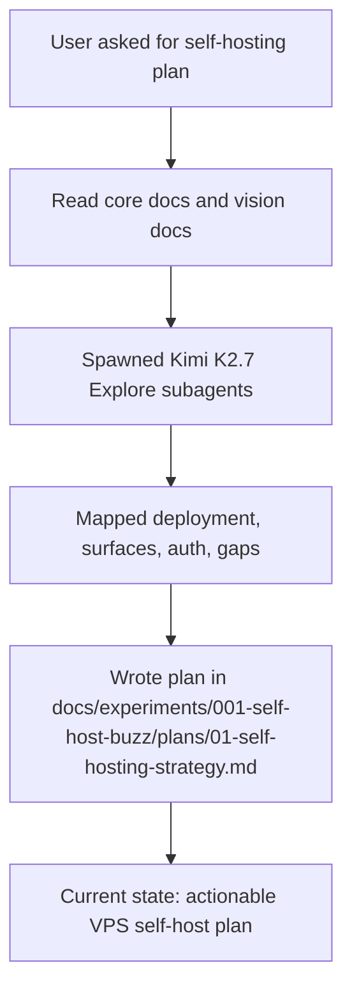

## What
- Read repo-level docs: `README.md`, `VISION.md`, `VISION_SOVEREIGN.md`, `CONTRIBUTING.md`, `ARCHITECTURE.md`, `.env.example`, `RELEASING.md`, `TESTING.md`.
- Read deployment docs: `deploy/compose/README.md`, `deploy/compose/compose.yml`, `deploy/compose/.env.example`, `deploy/charts/buzz/README.md`, `Dockerfile`.
- Used four Kimi K2.7 subagents to explore:
  - deployment surface
  - app/client surfaces
  - auth/operator requirements
  - self-hosting gaps/risks
- Wrote synthesized plan at:
  - `docs/experiments/001-self-host-buzz/plans/01-self-hosting-strategy.md`

## Key Takeaways
- Buzz **can** be self-hosted today.
- Best current path = **single-community, single-node VPS** using `deploy/compose/`.
- Docker support exists:
  - `Dockerfile` for relay image
  - `deploy/compose/` for VPS deployment
  - `deploy/charts/buzz/` for Helm/K8s
- Product is **desktop-first** today; web is limited; mobile still maturing.
- Real dependencies today: **Postgres + Redis + S3/MinIO + persistent git storage**.
- Important gaps for commercial self-hosting:
  - no real rate limiting
  - workflow approvals incomplete
  - some workflow actions stubbed
  - weak operator/admin UX
  - default Compose image tag is mutable `:main`

## Issues
- Repo/docs have some config drift: root `.env.example` still mentions Typesense, while current architecture says search is Postgres FTS.
- Compose VPS bundle cannot cleanly switch to external S3 via `.env`; it is pinned to bundled MinIO/path-style. Need Helm or custom Compose for external object store.
- Multi-community docs exist, but current practical self-host recommendation should stay single-community until operator story is hardened.

## Decisions
- Framed current recommendation as **early self-host offering for technical teams**, not polished general SaaS replacement.
- Recommended **Compose on VPS first**, Helm second.
- Recommended **one customer/team per deployment** for MVP.
- Explicitly avoided promising:
  - full browser workspace parity
  - mobile parity
  - enterprise workflow approvals
  - strong compliance posture

## Next
- Share plan summary with user, point to:
  - `docs/experiments/001-self-host-buzz/plans/01-self-hosting-strategy.md`
- If user wants next phase, produce one of these follow-ups:
  1. **Implementation checklist** for first VPS install pilot
  2. **Infra architecture** comparing Compose vs Helm vs managed services
  3. **Gap-closing roadmap** for making Buzz sellable as polished self-hosted offering
  4. **Concrete deployment runbook** with commands and env vars for first install
- If validating repo more deeply later, useful extra reads:
  - `crates/buzz-cli/README.md`
  - `docs/admin/README.md`
  - `docs/multi-tenant-relay.md`
  - `docs/multi-tenant-conformance.md`
