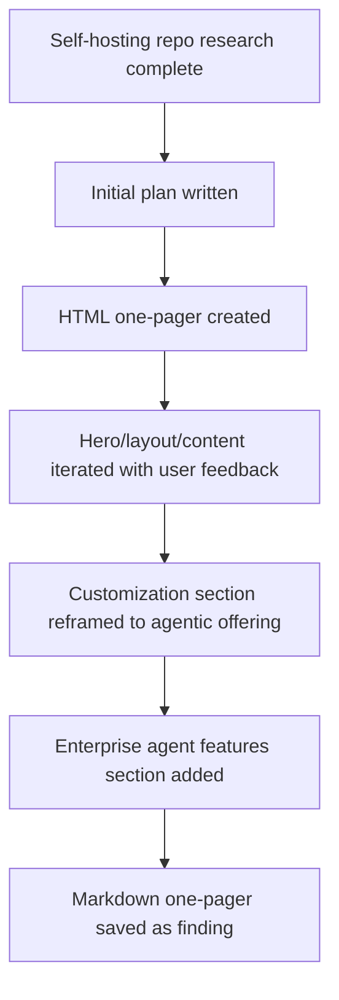

## What
- Created self-hosting plan:
  - `docs/experiments/001-self-host-buzz/plans/01-self-hosting-strategy.md`
- Created research docs for client customization surfaces:
  - `docs/experiments/001-self-host-buzz/research/01-prompt-client-customization-surfaces.md`
  - `docs/experiments/001-self-host-buzz/research/01-res-client-customization-surfaces.md`
- Created final HTML one-pager:
  - `docs/experiments/001-self-host-buzz/show-me-buzz-selfhost-onepager.html`
- Created markdown version of one-pager:
  - `docs/experiments/001-self-host-buzz/findings/01-selfhost-offering-onepager.md`
- Iterated one-pager content with user feedback:
  - hero copy corrected to say best path = one community on one VPS using `deploy/compose/`
  - bad founder-facing/internal framing removed
  - customization section reframed from infra-heavy to agentic-services-heavy
  - enterprise feature section converted into 3x2 bento with short examples
  - agent names highlighted only (no extra visual slop)
  - incident swarm card fixed to use actual agent role names (`incident agent`, `comms agent`, `follow-up agent`, `status agent`)

## Key Takeaways
- User wants this positioned as **self-hosted Buzz offering + multi-agent services offering**, not generic deployment memo, not frontend customization.
- Strongest offering framing now:
  - self-host Buzz on VPS today
  - custom multi-agent teams / prompts / routing / workflows as services layer
- Final emphasized agent-service examples in one-pager:
  - approval-gated autonomy
  - scoped permissions
  - persistent memory
  - incident swarm
  - release team
  - support triage team
- Markdown artifact now exists, not just HTML.

## Issues
- Initial one-pager had several UX/content misses called out by user:
  - hero stacked cards looked broken / overflowed
  - copy incorrectly implied “technical team” as best-fit instead of “VPS” as best deployment path
  - fake/internal framing like `Sections founders likely care about` was inappropriate and removed
  - agent-feature section was overdesigned when user only wanted inline highlight of agent names
- Takeaway: keep this artifact direct, minimal, technical, no decorative overreach.

## Decisions
- Stored final synthesized one-pager as a **finding**, not another plan:
  - `docs/experiments/001-self-host-buzz/findings/01-selfhost-offering-onepager.md`
- Kept HTML as primary presentational artifact, Markdown as durable experiment output.
- Reframed customization discussion toward **agentic surfaces**:
  - personas
  - prompts
  - routing
  - workflows
  - tool access
  - memory
  - packaged multi-agent teams
- Enterprise section now optimized for founder comprehension, not design flourish.

## Next
- If continuing, likely next useful tasks:
  1. tighten one-pager language further for founder presentation
  2. export HTML artifact to PDF
  3. produce second doc: concrete go-to-market packaging / pricing / service tiers for multi-agent offering
  4. produce technical implementation matrix: what is config-only vs workflow-only vs code-fork for agent offerings
- Primary files to continue from:
  - `docs/experiments/001-self-host-buzz/show-me-buzz-selfhost-onepager.html`
  - `docs/experiments/001-self-host-buzz/findings/01-selfhost-offering-onepager.md`
  - `docs/experiments/001-self-host-buzz/research/01-res-client-customization-surfaces.md`
- If editing HTML again, watch for user sensitivity to:
  - internal/meta labels
  - overdesigned accents
  - wording that blurs deployment shape vs buyer profile vs operator burden
