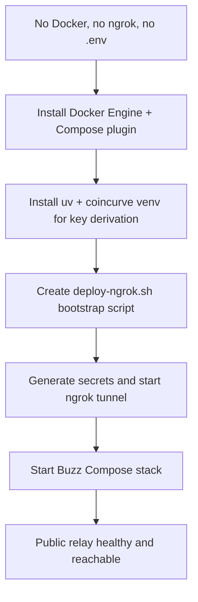

## What

- Installed Docker Engine 29.7.2 + Compose v2 plugin on Contabo Ubuntu 24.04.
- Installed uv and created `/opt/buzz-venv` with `coincurve` for Nostr pubkey derivation.
- Wrote `/root/buzz/deploy/compose/deploy-ngrok.sh`:
  - reads `NGROK_AUTH_TOKEN` from `/root/buzz/.env`
  - starts/reuses an ngrok tunnel to `localhost:3000`
  - generates stable relay key, owner pubkey, DB/Redis/S3/git secrets
  - writes `deploy/compose/.env` with dynamic ngrok URL wired into `RELAY_URL`, `BUZZ_MEDIA_BASE_URL`, `BUZZ_CORS_ORIGINS`
  - runs `./run.sh start` and adds the owner pubkey as an admin member
- Deployed Buzz successfully; public endpoint live and validated.

## Public URL

- **Relay WebSocket:** `wss://6069-2a02-c207-2351-9923-00-1.ngrok-free.app`
- **HTTPS root:** `https://6069-2a02-c207-2351-9923-00-1.ngrok-free.app`
- **NIP-11 info:** `curl -H 'Accept: application/nostr+json' https://6069-2a02-c207-2351-9923-00-1.ngrok-free.app/`
- **Health:** `https://6069-2a02-c207-2351-9923-00-1.ngrok-free.app/_liveness`

## Key Takeaways

- `deploy/compose/compose.yml` works without Caddy when plain HTTP is fronted by ngrok TLS.
- `RELAY_URL` must be set to the public tunnel URL before the relay starts; the relay reads it once at startup for NIP-11, NIP-42 AUTH, and membership events.
- `BUZZ_CORS_ORIGINS` must include the public origin.
- Passwords for DB/Redis URLs must avoid `/` characters; base64-generated passwords caused `invalid port number` because `/` is unescaped in `DATABASE_URL`. Switched to hex32 secrets.
- Validation passed: NIP-11 JSON, liveness, media route (405), git route (401), and WebSocket AUTH challenge all work.

## Issues

- First start failed with `database error: invalid port number` — caused by base64 password containing `/` in `DATABASE_URL`. Fixed by using hex secrets.
- `/_status` on port 8080 is not exposed externally; not needed for public use.

## Decisions

- Used `ghcr.io/block/buzz:main` image for this demo deployment.
- Used dynamic free ngrok URL; if the tunnel restarts the URL will change. For a stable URL, reserve a static ngrok domain and set `NGROK_STATIC_DOMAIN` in `/root/buzz/.env` before running `deploy-ngrok.sh`.
- Owner private key and all other secrets are stored in `/root/buzz/deploy/compose/.env`.

## Next

- Back up `/root/buzz/deploy/compose/.env` immediately (contains `BUZZ_RELAY_PRIVATE_KEY`, DB/Redis/S3 secrets, owner keys).
- To manage the deployment:
  - Stop: `cd /root/buzz/deploy/compose && ./run.sh stop`
  - Start: `cd /root/buzz/deploy/compose && ./run.sh start`
  - Logs: `cd /root/buzz/deploy/compose && ./run.sh logs`
  - Stop ngrok: `pkill ngrok`
- To redeploy with a new ngrok URL, run `/root/buzz/deploy/compose/deploy-ngrok.sh` again.
