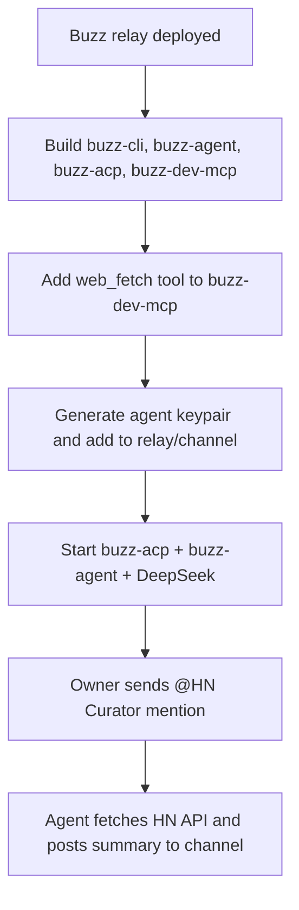

## What

- Built release binaries: `buzz`, `buzz-agent`, `buzz-acp`, `buzz-dev-mcp`.
- Added a `web_fetch` MCP tool to `buzz-dev-mcp` so agents can read public HTTP/HTTPS APIs.
- Created a minimal HackerNews persona pack at `/root/buzz/packs/hacker-news/`.
- Generated a dedicated agent keypair, added the agent as a relay member and as a bot member of channel `ecfea7b1-e369-4ff8-917a-18abb2c2b8a8`.
- Started `buzz-acp` backed by `buzz-agent` + `buzz-dev-mcp`, using DeepSeek via the OpenAI-compatible endpoint.
- The owner sent `@HN Curator what are the top 5 HackerNews stories right now?` and the agent replied in the channel with a numbered list of stories + scores + links.

## Public URL / state

- Relay: `wss://6069-2a02-c207-2351-9923-00-1.ngrok-free.app`
- Test channel: `ecfea7b1-e369-4ff8-917a-18abb2c2b8a8`
- Agent pubkey: `3dd3386c519b77d6df0e0753fd0597859a74687f642b5b5644d94ff4797977ea`
- Agent log: `/tmp/buzz-acp.log`
- System prompt: `/tmp/hn-curator-prompt.txt`

## Key Takeaways

- `buzz-acp` needs explicit child env vars for the LLM provider; the `buzz-agent` subprocess does not see the parent `.env` automatically.
- Agent must be added as a channel member before `buzz-acp` will discover/subscribe to the channel.
- `web_fetch` tool was necessary because no built-in agent tool could read plain JSON/text URLs.
- DeepSeek works through the OpenAI-compatible endpoint: `OPENAI_COMPAT_BASE_URL=https://api.deepseek.com/v1` with model `deepseek-chat`.
- The agent used shell tool `buzz messages send` to post back to the channel.

## Issues

- First ACP start failed because `BUZZ_AGENT_PROVIDER` was not passed to the agent child.
- First CLI channel creation failed against `http://localhost:3000` because relay communities are seeded from the public `RELAY_URL` host. Switching CLI to the public ngrok URL fixed it.
- Agent responses depend on DeepSeek interpreting the system prompt; may need tighter instructions for exact story counts and formatting.

## Decisions

- Used the public ngrok URL for both CLI and ACP to avoid host/community mismatch.
- Gave the agent a dedicated keypair rather than reusing the owner key.
- Set `--respond-to owner-only` for the demo so only the owner can trigger the agent.
- Kept the agent running detached for ongoing testing.

## Next

- To view the latest messages: `buzz --format compact messages get --channel ecfea7b1-e369-4ff8-917a-18abb2c2b8a8 --limit 20`
- To watch the agent work: `tail -f /tmp/buzz-acp.log`
- To restart the agent: kill `buzz-acp` process and rerun the start command (or script it).
- Hardening ideas:
  - add a wrapper script `/root/buzz/run-hn-agent.sh` with all env vars
  - switch to a static ngrok domain so the channel/agent setup survives tunnel restarts
  - improve the system prompt / persona to constrain output format and avoid hallucinated URLs
