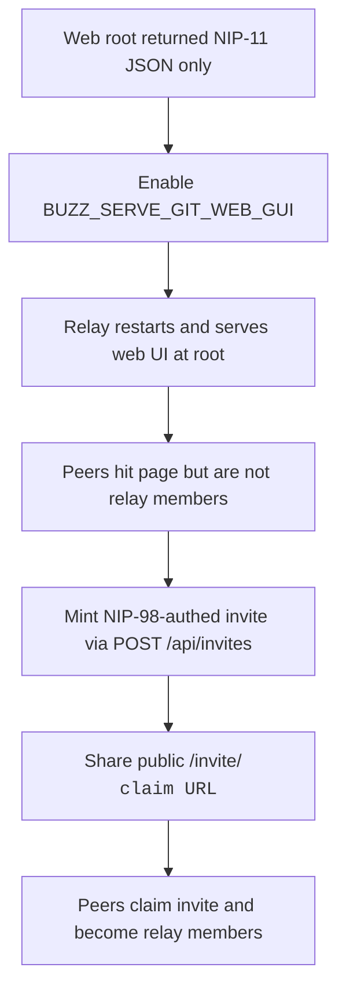

## What

- Enabled the bundled web UI by adding `BUZZ_SERVE_GIT_WEB_GUI=true` to `deploy/compose/.env` and restarting the relay.
- Confirmed `GET /` with `Accept: text/html` now returns the Buzz web app HTML instead of only NIP-11 JSON.
- Minted a relay invite via `POST /api/invites` signed with NIP-98 (kind:27235) using the owner key.
- Generated a public invite claim URL that peers can open in a browser to join the relay.

## Public URLs

- **Web UI / claim page:** `https://6069-2a02-c207-2351-9923-00-1.ngrok-free.app/`
- **Invite claim URL:** `https://6069-2a02-c207-2351-9923-00-1.ngrok-free.app/invite/v2.rnbMO9N9GZ1ee4ocus-CejMdiDnRW6NTIdXzHA6A8Ig`
- **Relay:** `wss://6069-2a02-c207-2351-9923-00-1.ngrok-free.app`

## Key Takeaways

- The relay root `/` is content-negotiated: `Accept: application/nostr+json` returns NIP-11; HTML/WebSocket requests are handled differently. Enabling `BUZZ_SERVE_GIT_WEB_GUI` lets the SPA fallback serve the web bundle at `/`, `/repos`, etc.
- New users/keys hit `restricted: not a relay member` until they are added to relay membership.
- The easiest peer onboarding path is the invite flow: owner mints an invite, share `/invite/<code>`, peer claims it.
- `POST /api/invites` requires NIP-98 HTTP auth signed by an owner/admin key.

## Issues

- Peers visiting the web URL without being relay members saw `restricted: not a relay member`.
- `buzz-cli` has no `invites` subcommand, so invites must be minted via the authenticated HTTP API.

## Decisions

- Used `pynostr` in the existing `/opt/buzz-venv` to build and sign the NIP-98 auth event.
- Created a 10-use invite valid for 72 hours so the link can be shared with multiple peers.
- Did not add peers manually as members; invite flow is more scalable and does not require collecting pubkeys upfront.

## Next

- Share the invite claim URL with peers.
- After peers claim, they can use the desktop app with the relay URL `wss://6069-2a02-c207-2351-9923-00-1.ngrok-free.app`.
- Update `docs/guides/self-host-vps-ngrok.md` with the invite flow and `BUZZ_SERVE_GIT_WEB_GUI` step.
- To mint more invites, reuse the Python NIP-98 script or wrap it in a helper.
