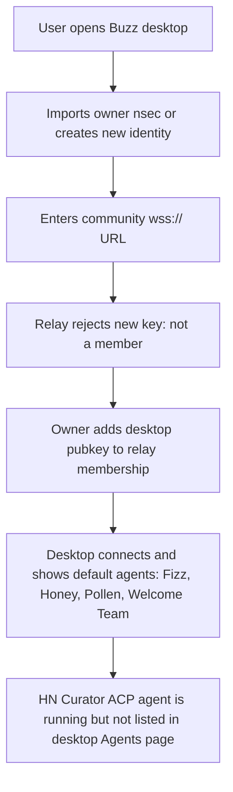

## What

- User successfully connected Buzz desktop to the relay using the community URL `wss://6069-2a02-c207-2351-9923-00-1.ngrok-free.app`.
- Desktop imported/created a new identity with pubkey `2011c6f884adb7c174b2c0223431fb31f5d43f152e63d4001635609dee9c2caa`.
- That key was not a relay member, causing `Load failed`. Added it as a member; connection succeeded.
- Desktop Agents page shows built-in agents (`Fizz`, `Honey`, `Pollen`, `Welcome Team`).
- The HN Curator agent is running as an external ACP process (`buzz-acp` + `buzz-agent` + DeepSeek). It is not registered as a desktop-visible persona, so it does not appear in the Agents page.

## Key Takeaways

- ACP agents that run outside the desktop app do not automatically appear in the desktop Agents catalog.
- The desktop catalog shows personas/agents registered through the desktop flow (`buzz agents draft-create`, persona packs installed in the app data directory, or built-in defaults).
- The external ACP agent still works: mention its pubkey in a channel and it responds.
- Desktop onboarding asks for community URL (the relay wss:// URL) and may require the owner to add the new pubkey if membership is enforced.

## Issues

- Confusion about why `HackAgent` is missing from the desktop Agents page.
- New desktop identity was not pre-authorized; required manual `add-member`.

## Decisions

- Keep the ACP HN agent running as an external agent for now; document that it is triggered by mention, not by the Agents page.
- Update the guide to explain the desktop onboarding flow and the difference between ACP agents and desktop-registered agents.
- Optionally create a desktop-visible agent draft later so `HN Curator` appears in the Agents page.

## Next

- Update `docs/guides/self-host-vps-ngrok.md` with:
  - Desktop onboarding steps
  - How to add a new desktop identity as relay member
  - Where ACP agents appear (or don't appear)
- To make HN Curator appear in desktop Agents page, create an agent draft via `buzz agents draft-create` or register a persona pack in the desktop app data directory.
- Test a mention of the agent in a channel to confirm it still responds.
