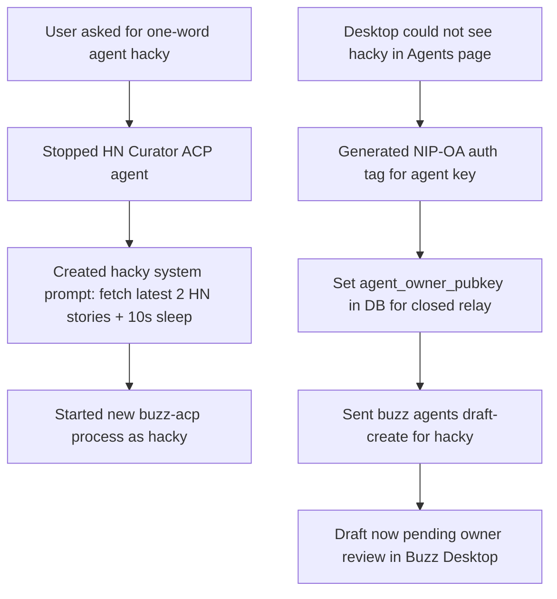

## What

- Renamed the ACP agent to **hacky** (one word, no spaces).
- Updated system prompt to fetch only the **latest 2 HackerNews stories** and add a **10-second `sleep`** before posting so the loading state is visible.
- Started a new `buzz-acp` process with the hacky prompt.
- Created `run-hacky.sh` at repo root to restart the agent easily.
- Generated a NIP-OA `BUZZ_AUTH_TAG` so `buzz agents draft-create` could run.
- Because the relay runs in closed-membership mode, the agent-owner mapping was not set automatically, so we set `agent_owner_pubkey` directly in the `users` table.
- Sent a create-agent draft to the desktop app for **hacky**; it now appears as a pending draft for the owner to review and save.

## Key URLs / IDs

- Relay: `wss://6069-2a02-c207-2351-9923-00-1.ngrok-free.app`
- Web UI: `https://6069-2a02-c207-2351-9923-00-1.ngrok-free.app/`
- Channel: `ecfea7b1-e369-4ff8-917a-18abb2c2b8a8`
- Agent pubkey: `3dd3386c519b77d6df0e0753fd0597859a74687f642b5b5644d94ff4797977ea`
- Draft request ID: `d6e843db-5dae-4268-b4aa-001a33712b73`
- Agent log: `/tmp/hacky-acp.log`
- Start script: `/root/buzz/run-hacky.sh`

## Key Takeaways

- ACP agents respond to mentions but are invisible in the desktop Agents page until registered as a persona/agent draft.
- `buzz agents draft-create` requires `BUZZ_AUTH_TAG` (NIP-OA owner attestation) and an `agent_owner_pubkey` mapping in the relay DB.
- On a closed relay, the NIP-OA mapping is not auto-materialized during WebSocket auth, so a manual DB update or an open-relay deployment is needed for the CLI draft flow.
- Adding `sleep 10` in the prompt lets users see the agent "typing"/working state before the answer appears.

## Issues

- `buzz agents draft-create` initially failed with `observer frame is not authorized for this agent owner` because `users.agent_owner_pubkey` was NULL for the agent key.
- Direct DB update is a workaround; in a production/open-relay setup the mapping would be established automatically.

## Decisions

- Keep the agent logic minimal: fetch top 2 stories, sleep, summarize.
- Use a server-side ACP agent rather than a desktop-local runtime so the agent runs 24/7 on the VPS.
- Commit `run-hacky.sh` as a helper for restarting the agent.

## Next

- Owner opens Buzz Desktop → Agents → review and save the **hacky** draft.
- After saving, hacky appears in the Agents page and can be added to channels.
- Test by sending `@hacky news` in `#agents`; expect a ~10-second delay, then two story summaries.
- Update the guide with the hacky-specific steps and NIP-OA/DB note.
