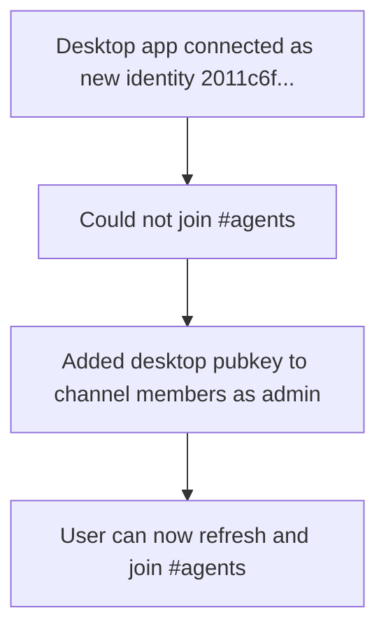

## What

- The desktop app connected using a newly generated identity with pubkey `2011c6f884adb7c174b2c0223431fb31f5d43f152e63d4001635609dee9c2caa`.
- That identity was already a relay member but was not a member of the `#agents` channel.
- Added the desktop identity as an admin member of channel `ecfea7b1-e369-4ff8-917a-18abb2c2b8a8`.

## Key URLs / IDs

- Relay: `wss://6069-2a02-c207-2351-9923-00-1.ngrok-free.app`
- Channel: `ecfea7b1-e369-4ff8-917a-18abb2c2b8a8`
- Desktop pubkey: `2011c6f884adb7c174b2c0223431fb31f5d43f152e63d4001635609dee9c2caa`

## Key Takeaways

- Relay membership and channel membership are separate.
- A user can be a relay member but still unable to view/join a channel until they are added to that channel's roster.
- The CLI command `buzz channels add-member` adds a member to a specific channel.

## Issues

- Desktop user saw a failure when trying to join `#agents` because their pubkey was not in the channel membership event.

## Decisions

- Gave the desktop identity `admin` role in `#agents` so the user has full channel control.
- Recorded the desktop pubkey in `.env` as `DESKTOP_PUBKEY` for future ops.

## Next

- Refresh or restart Buzz Desktop and join `#agents`.
- Mention `@hacky news` in the channel to test the agent.
- Update the guide to include this step in the desktop onboarding section.
